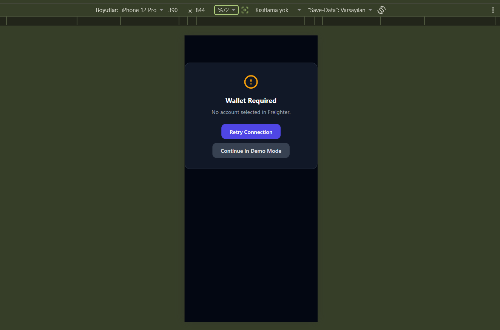
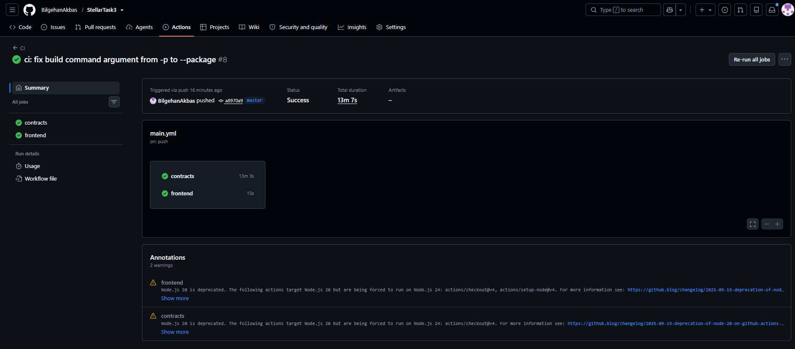
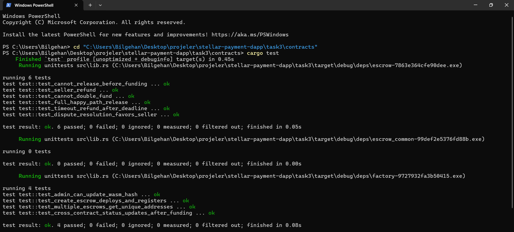

# Decentralized Escrow — Stellar / Soroban (Orange Belt)

A production-ready, fully-tested decentralized escrow system built on
Stellar's Soroban smart-contract platform. Two contracts — **Factory** and
**Escrow** — communicate via cross-contract calls, emit rich events, and
are paired with a mobile-responsive React frontend and a CI/CD pipeline.

## Live Demo

| Resource | Link |
|----------|------|
| **Frontend (Vercel)** | [stellar-task3.vercel.app](https://stellar-task3.vercel.app/) |
| **Factory Contract** | [CABYZH6P4DCMQMWF2R3OPJXG64EBLNAXJZYZIFAWT3GRGVZOHXLP6I66](https://stellar.expert/explorer/testnet/contract/CABYZH6P4DCMQMWF2R3OPJXG64EBLNAXJZYZIFAWT3GRGVZOHXLP6I66) |
| **Deploy Transaction** | [2c86d7...06dd](https://stellar.expert/explorer/testnet/tx/2c86d7176c040116c973cfa0370a2391a9521f71f4cacd6dffff8d58f97206dd) |
| **Escrow Wasm Upload** | [807253...f1c6](https://stellar.expert/explorer/testnet/tx/80725374e35a17d79b1a8dc7ecf8dc7783ee89e6c8294862293d205bad69f1c6) |
| **Factory Wasm Upload** | [2bcac7...ad09](https://stellar.expert/explorer/testnet/tx/2bcac7738bbce0629f1494dbfa9adffad7b5638fa49d33648addb2538ee6ad09) |
| **CI/CD Status** | [GitHub Actions](https://github.com/BilgehanAkbas/StellarTask3/actions) |

### Deployment Info

```
Network:        Stellar Testnet
Factory ID:     CABYZH6P4DCMQMWF2R3OPJXG64EBLNAXJZYZIFAWT3GRGVZOHXLP6I66
Escrow Wasm:    14f70cd3650e70c71d531085bd455ace7d6ce506af22a76127c3a640b20ad1a3
Factory Wasm:   66a43ff2edbba8f7bcf6daea3209b33cd5f13c6de4947861c3ab8610e6005efd
RPC URL:        https://soroban-testnet.stellar.org
```

---

## Architecture

```
┌──────────────────────────────────────────────┐
│                 Frontend (React)              │
│  Freighter wallet → Soroban RPC → Factory     │
│  • Real-time event polling (5s interval)     │
│  • Escrow actions: fund, release, refund,    │
│    dispute, resolve, cancel, claim timeout    │
│  • Mobile-responsive Tailwind CSS            │
└──────────────────┬───────────────────────────┘
                   │ contract calls
┌──────────────────▼───────────────────────────┐
│              Factory Contract                 │
│  • Deploys new Escrow instances (deploy_v2)  │
│  • Tracks all escrows in a Vec<Address>      │
│  • Cross-contract queries Escrow for status  │
│  • Emits `esc_new` event on creation         │
└──────────────────┬───────────────────────────┘
                   │ cross-contract call
┌──────────────────▼───────────────────────────┐
│              Escrow Contract (N instances)    │
│  • State machine: Pending→Funded→(Released   │
│    | Refunded | Disputed→Resolved)           │
│  • SAC token transfer, auth checks, TTL mgmt │
│  • Events: created, funded, released,        │
│    refunded, disputed, resolved, cancelled   │
└──────────────────────────────────────────────┘
```

### Contract Lifecycle

```
Pending ──fund()──▶ Funded ──release()──▶ Released
  │                    │
  │                    ├──refund()──▶ Refunded
  │                    │
  │                    ├──claim_timeout_refund()──▶ Refunded
  │                    │
  │                    ├──open_dispute()──▶ Disputed
  │                    │                       │
  │                    │  resolve_dispute(true)──▶ Released
  │                    │  resolve_dispute(false)─▶ Refunded
  │                    │
  cancel()──▶ Cancelled
```

---

## Repository Structure

```
.
├── .github/workflows/main.yml   # CI/CD pipeline (build, lint, test, deploy)
├── contracts/
│   ├── common/
│   │   ├── Cargo.toml
│   │   └── src/lib.rs           # Shared types, errors, EscrowInterface
│   ├── escrow/
│   │   ├── Cargo.toml
│   │   └── src/lib.rs           # Escrow contract + 6 tests
│   └── factory/
│       ├── Cargo.toml
│       └── src/lib.rs           # Factory contract + 4 tests
├── scripts/
│   └── deploy.sh                # Automated deploy script
├── screenshots/                 # Mobile UI, CI pipeline, test output
├── frontend/
│   ├── package.json
│   ├── vercel.json              # Vercel deploy config
│   ├── vite.config.js
│   ├── eslint.config.js         # Flat ESLint config (React + hooks rules)
│   ├── tailwind.config.js
│   ├── postcss.config.js
│   ├── index.html
│   ├── .env.example
│   └── src/
│       ├── main.jsx             # React entrypoint
│       ├── index.css            # Tailwind directives
│       ├── App.jsx              # Main UI (mobile-responsive, event streaming)
│       ├── App.test.jsx         # 3 frontend tests
│       ├── contracts.js         # Soroban client helpers + event polling
│       ├── hooks/useFreighter.js
│       └── test-setup.js
├── Cargo.toml                    # Workspace root
└── README.md
```

---

## Screenshots

| Mobile Responsive UI | CI/CD Pipeline | Test Output (13 passing) |
|---|---|---|
|  |  |  |

---

## Demo / Example Accounts (Testnet)

These are the Stellar Testnet addresses used to produce the screenshots and
demo walkthrough in this repo. Anyone reviewing the project can look these
up directly on [stellar.expert](https://stellar.expert/explorer/testnet) or
reuse them to interact with the deployed contracts.

| Role | Address |
|------|---------|
| **Buyer** (main demo wallet) | `GC4B4EIUDYKAGLSJ6KVCV2NF22BWYOQFZHRUWXTMPM4Y2Q5CPBYNDONJ` |
| **Seller** | `GD4JEB342IJ3W66YN3LU3AX5YNBVS7GVNPI6JYFK7REZAFM6YRI6QQKF` |
| **Arbiter** | `GBZEE6RDWTAVZI3IWEESCPFO2IZUMCFMCEPRMH44F6S7PUADPDB2WH7R` |
| **Token Contract ID** | `CDLZFC3SYJYDZT7K67VZ75HPJVIEUVNIXF47ZG2FB2RMQQVU2HHGCYSC` |

> ⚠️ These are Testnet-only demo keys with no real value — do not reuse them
> on Mainnet or treat them as secrets.

---

## Recent Fixes (Frontend Error Handling)

A few UX/correctness issues were found and fixed after initial testing:

| Issue | Fix |
|-------|-----|
| Action buttons (Release / Open Dispute / Claim Timeout) showed a different, unreadable raw XDR/diagnostic string on every failure | Soroban surfaces contract-level errors (`EscrowError` codes) during **simulation**, inside `server.prepareTransaction()` — not at submit time. `contracts.js` now catches that specifically, extracts the numeric error code (`Error(Contract, #N)`), and maps it to a human-readable message via a shared `describeSimulationFailure()` helper used by every write action and by `CreateEscrowForm`. |
| "Claim Timeout" was clickable before the deadline ledger was actually reached | `EscrowCard` now fetches the current ledger (`fetchLatestLedger()`) alongside escrow details and disables the button — showing ledgers-remaining — until `currentLedger >= deadline_ledger`. |
| Duplicate JSX: "Open Dispute" was defined twice (once for buyer, once for seller) with identical code | Merged into a single `status === "Funded" && (isBuyer || isSeller)` block. |
| Amount display assumed a hardcoded 7 decimals (correct for XLM, wrong for other SEP-41 tokens) | Added `fetchTokenDecimals()`, which reads the token contract's `decimals()` view (cached per token address) and drives the displayed amount instead of a hardcoded `10 ** 7`. |

---

## Repo Hygiene / CI Fixes (Latest Pass)

A full review of the repo — actually running `npm ci`, `npm run lint`, `npm test`, and `npm run build`, not just reading the code — turned up a few real issues, now fixed:

| Issue | Fix |
|-------|-----|
| `npm run lint` failed outright — ESLint 9 requires a flat `eslint.config.js`, which didn't exist even though the lint dependencies (`@eslint/js`, `eslint-plugin-react-hooks`, `eslint-plugin-react-refresh`) were already in `package.json` | Added `frontend/eslint.config.js`. Also added `eslint-plugin-react` so components that are only referenced inside JSX (e.g. `<EscrowCard />`) aren't flagged as unused. |
| `contracts.js` had two `try { ... } catch (err) { throw err; }` blocks that caught and rethrew the same error unchanged (`no-useless-catch`) | Removed both no-op wrappers in `fetchEscrowStatus` / `fetchEscrowDetails`. |
| CI workflow never actually ran ESLint, even though the README claimed it did | Added a `Lint` step to the `frontend` job in `.github/workflows/main.yml`, right after `npm ci` and before tests. |
| `frontend/.env.example` and `scripts/deploy.sh` wrote `VITE_RPC_URL`, but `contracts.js` / `App.jsx` actually read `VITE_SOROBAN_RPC_URL` — harmless only because the code falls back to the same default testnet URL, but misleading for anyone pointing at a different RPC | Renamed the variable in both files to `VITE_SOROBAN_RPC_URL`. |
| Two stray debug artifacts were committed to the repo (`full-fix.diff`, `frontend/sdk_exports.txt`) — leftover scratch files, not part of the app | Removed both. |
| README's repository-structure diagram showed `Cargo.toml` nested inside `contracts/`, but it actually lives at the repo root | Corrected the diagram and added files that were missing from it (`eslint.config.js`, `main.jsx`, `index.css`, `postcss.config.js`, `index.html`). |

After these fixes, `npm run lint` passes with zero warnings, and `npm test -- --run` / `npm run build` both still pass cleanly.

---

| Tool               | Version    |
|--------------------|------------|
| Rust               | ≥ 1.86.0   |
| Soroban CLI        | ≥ 22.0.0   |
| Node.js            | ≥ 22       |
| npm                | ≥ 10       |
| Freighter (browser)| Latest     |

---

## Quick Start

### 1. Clone & install

```bash
git clone https://github.com/BilgehanAkbas/StellarTask3.git
cd StellarTask3
```

### 2. Build contracts

```bash
stellar contract build -p escrow
stellar contract build -p factory
```

### 3. Run contract tests

```bash
cargo test --workspace -p escrow-common -p escrow -p factory
```

### 4. Deploy to Stellar Testnet (automated)

```bash
# Using the deploy script (requires Stellar CLI with a funded testnet key)
bash scripts/deploy.sh

# Or manually:
stellar contract upload --wasm target/wasm32v1-none/release/escrow.wasm --source <YOUR_KEY> --network testnet
stellar contract upload --wasm target/wasm32v1-none/release/factory.wasm --source <YOUR_KEY> --network testnet
stellar contract deploy \
  --wasm-hash <FACTORY_WASM_HASH> \
  --source <YOUR_KEY> \
  --network testnet \
  -- --admin <YOUR_PUBKEY> --escrow_wasm_hash <ESCROW_WASM_HASH>
```

### 5. Start frontend

```bash
cd frontend
cp .env.example .env
# Edit .env with your contract IDs
npm install
npm run dev
```

### 6. Run frontend tests

```bash
npm test
```

---

## CI/CD

The GitHub Actions pipeline (`.github/workflows/main.yml`) runs on every push
and PR to `master`:

- **contracts job**: Installs Rust + Soroban CLI 27.0.0, builds escrow & factory WASM, runs `cargo test` (10 tests).
- **frontend job**: Installs Node 22 (`npm ci`), runs `npm run lint` (ESLint, flat config), `npm test -- --run` (3 tests), then `npm run build` (Vite production build).
- **deployment**: Vercel auto-deploys on push via Git integration.

Both jobs run in parallel and must pass before a push/PR is considered green.

---

## Event Streaming

The frontend polls Soroban RPC for contract events every 5 seconds and displays a live event log.

| Event name       | Emitted by | When                                      |
|------------------|------------|-------------------------------------------|
| `created`        | Escrow     | Constructor completes                     |
| `funded`         | Escrow     | Buyer deposits SAC tokens                 |
| `released`       | Escrow     | Buyer releases to seller                  |
| `refunded`       | Escrow     | Seller returns to buyer (voluntary)       |
| `disputed`       | Escrow     | Either party opens a dispute              |
| `resolved`       | Escrow     | Arbiter resolves a dispute                |
| `cancelled`      | Escrow     | Either party cancels before funding       |
| `timeout`        | Escrow     | Buyer claims after deadline               |
| `esc_new`        | Factory    | A new Escrow instance is deployed         |

---

## Test Coverage

### Contracts (10 tests total)

| Contract | Test | What it verifies |
|----------|------|-------------------|
| Escrow | `test_full_happy_path_release` | Pending→Fund→Release, balances |
| Escrow | `test_seller_refund` | Fund→Refund, buyer gets money back |
| Escrow | `test_dispute_resolution_favors_seller` | Dispute→Resolve→Released |
| Escrow | `test_timeout_refund_after_deadline` | Fund→timeout→Refund |
| Escrow | `test_cannot_release_before_funding` | Error: release before fund |
| Escrow | `test_cannot_double_fund` | Error: fund twice |
| Factory | `test_create_escrow_deploys_and_registers` | Deploy count, list, cross-contract status |
| Factory | `test_cross_contract_status_updates_after_funding` | Factory reads live Funded status |
| Factory | `test_multiple_escrows_get_unique_addresses` | Deterministic salt = unique addrs |
| Factory | `test_admin_can_update_wasm_hash` | Admin upgrades Wasm hash |

### Frontend (3 tests)

| Test | What it verifies |
|------|-------------------|
| Shows wallet loading spinner | Loading state renders correctly |
| Shows connectivity error | Error state when Freighter missing |
| Renders main UI after wallet connects | Connected state shows full UI |

---

## Security Considerations

- `require_auth()` is called on every state-mutating function.
- Buyer-seller equality is rejected at construction (`InvalidParties`).
- Zero and negative amounts are rejected.
- Past deadlines are rejected at construction.
- TTL is bumped on every storage write to prevent ledger eviction.
- Only the designated arbiter can resolve disputes.
- Only the admin can upgrade the Escrow Wasm hash.

---

## Requirements Checklist (Level 3 - Orange Belt)

| Requirement | Status |
|-------------|--------|
| Public GitHub repository | [StellarTask3](https://github.com/BilgehanAkbas/StellarTask3) |
| README with complete documentation | Done |
| 10+ meaningful commits | Done (29+) |
| Live demo link (Vercel) | [stellar-task3.vercel.app](https://stellar-task3.vercel.app/) |
| Contract deployment address | `CABYZH6P4...I66` |
| Transaction hash for contract interaction | `2c86d7...06dd` |
| Screenshot: mobile responsive UI | ✅ See [Screenshots](#screenshots) |
| Screenshot: CI/CD pipeline running | ✅ See [Screenshots](#screenshots) |
| Screenshot: test output, 3+ passing tests | ✅ See [Screenshots](#screenshots) — 13 tests passing |
| Inter-contract communication | ✅ Factory ↔ Escrow via `EscrowClient` (see Architecture) |
| Event streaming & real-time updates | ✅ 9 event types, 5s polling (see Event Streaming) |
| CI/CD pipeline | ✅ Lint + test + build on every push/PR (see CI/CD) |
| Error handling & loading states | ✅ Simulation-error decoding, loading skeletons, connectivity fallback |
| Tests for contracts and frontend | ✅ 10 contract tests + 3 frontend tests, all passing |
| **Demo video link (1–2 min)** | ⚠️ **Not yet added** — record a short walkthrough (create escrow → fund → release/dispute) and paste the link here before final submission |

---